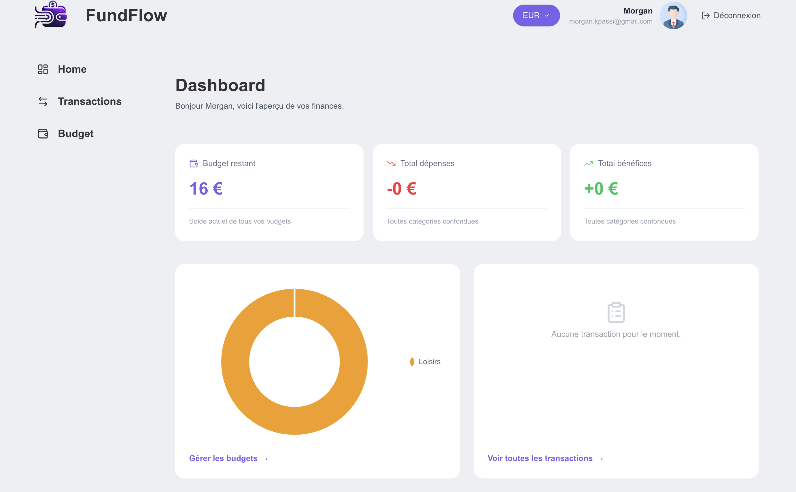
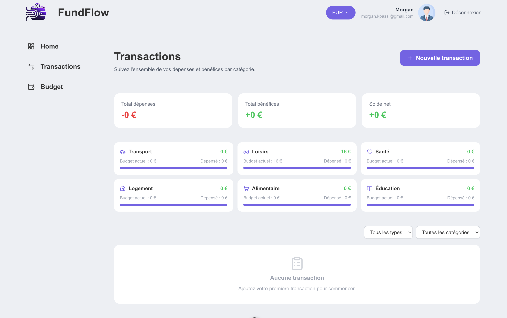
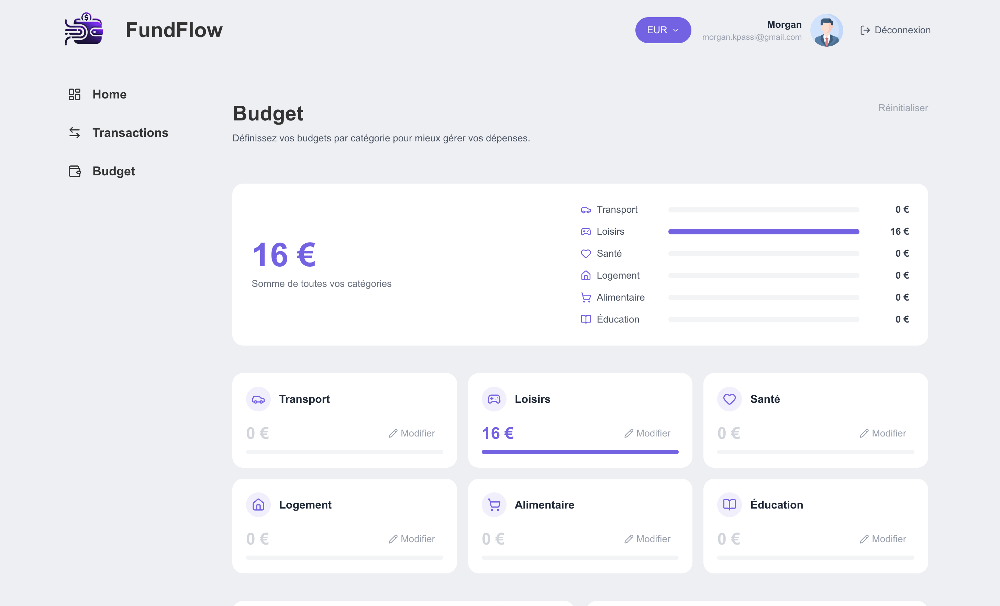

## Navigation
# FundFlow - Nuxt Application

**FundFlow** is a financial management application built with **Nuxt**, designed to help track and organize fund flows, budgets, and transactions.

## Table of Contents
- [Features](#features)
- [Installation](#installation)
- [Usage](#usage)
- [Screenshots](#screenshots)
- [Limitations & Improvements](#limitations--improvements)
- [Contributing](#contributing)
- [License](#license)

## Features

- **Transaction Tracking** - Record and categorize financial transactions
- **Budget Management** - Set and monitor spending budgets
- **Financial Reports** - Generate analytics and insights
- **Multi-currency Support** - Handle multiple currencies
- **Responsive Dashboard** - View your financial overview at a glance

## Installation

```bash
git clone https://github.com/kps-243/fundflow.git
cd fundflow
npm install
npm run dev
```

## Usage

Start the development server:
```bash
npm start
```

Navigate to `http://localhost:3000` and explore the dashboard to manage your finances.

## Application Preview

### Home
Main dashboard providing a clear and quick overview of the most important information.



---

### Transactions
Interface to easily view, add, and manage all financial transactions.



---

### Budget
Dedicated section for tracking and managing your budget, with simple visualizations to better control your expenses.



## Limitations & Improvements

### Current Limitations
- Single-user support only
- No data export functionality
- Limited report customization

### Planned Improvements
- User authentication & multi-user support
- Advanced filtering and search
- CSV/PDF export options
- Mobile app version
- Real-time notifications

## Contributing

Contributions are welcome. Please fork the repository and submit a pull request.

## License

MIT License - see LICENSE file for details